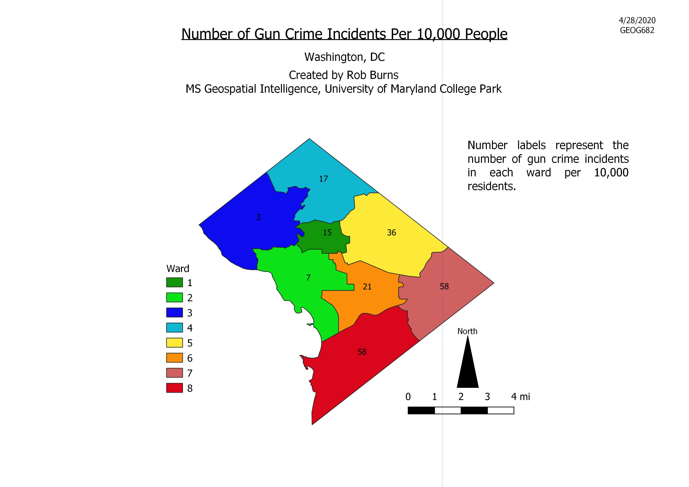
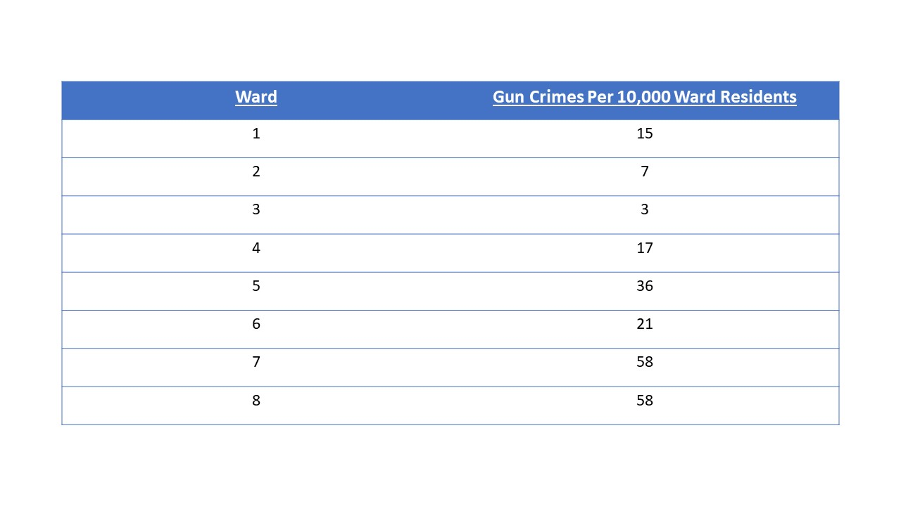
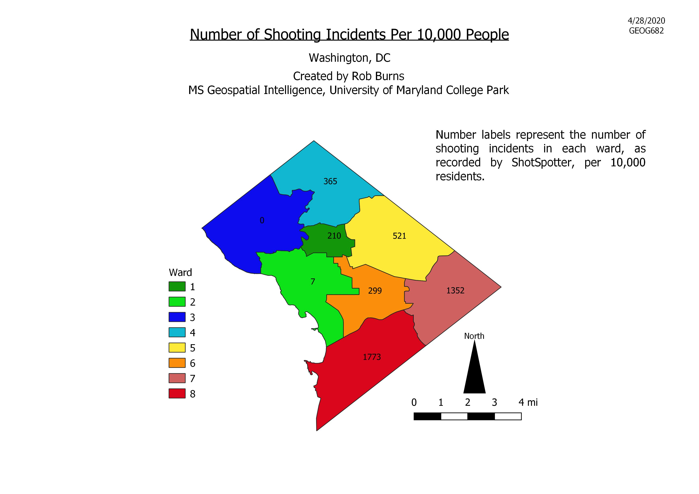
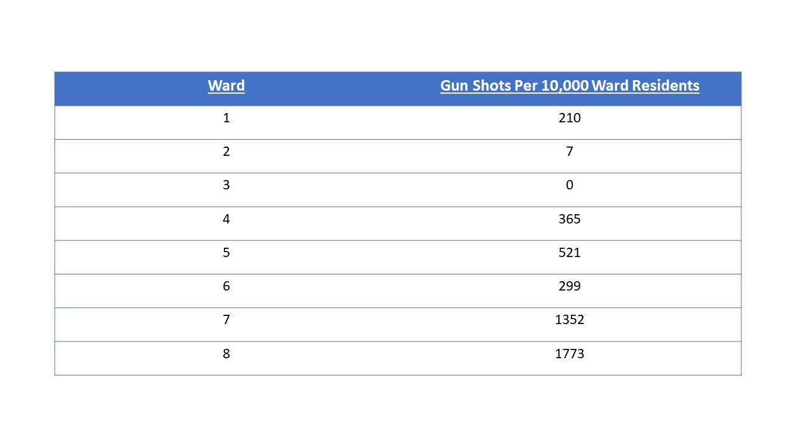

# GEOG682 Final Project
## Washington, DC Gun Crime Analysis Mapping
Rob Burns

4/28/2020


## Introduction

This is my final project for GEOG682 "Open Source Intelligence", a class that is part of the University of Maryland's Geospatial 
Intelligence Masters Program. For this project I will be analyzing gun crime data made publicly available by the city of Washington, DC 
to determine which areas of the city are most heavily effected by gun crime. Specifically I will be looking at which wards within the 
city have the highest rates of gun incidents per 10,000 ward residents. "Gun incidents" here is a multi-part phenomenon, as I will be 
looking separately at 2 different types of gun incidents: gun crimes and gun shots, both reported by the Washington DC, Metropolitan 
Police Department (MPD). Gun crimes are reported by the DC MPD using Analytical Services Application (ASAP) and gun shots are detected 
using Shot Spotter, a sensor network operated throughout DC by MPD. First I will perform my analysis manually using QGIS 3.4.9 and the 
tools and features it provides. This manual analysis within QGIS will determine the rates of gun crime and gun shots within each of DC's 
wards and will be used to produce maps that graphically depict my results. Then I will also attempt to automate this process using the 
QGIS Python Console and PYQGIS scripting. Python scripting will allow for automating the process of importing and performing spatial 
analysis on my input layers and will in the end show us the desired result of the rate of gun incidents in each ward, though this PyQGIS 
automation will not be used to synthesize these results into a map. All of this analysis will be evaluated with the goal of determining 
potential locations for expanding the DC MPD's Shot Spotter network, looking for new locations that would provide the most benefit for 
new Shot Spotter sensor placement. 

## Analysis

 This analysis made use of 3 datasets made available by the Washington, DC Office of the Chief Technology Officer as shapefiles on 
 the "Open Data DC" website (https://opendata.dc.gov/):

 1) "Shot Spotter Gun Shots": A point layer showing the locations of gun shots in DC detected by Shot Spotter.
 2) "Ward from 2012": A polygon layer representing the boundaries of DC's 2012 election wards.
 3) "Crime Incidents in 2017": A point layer representing the locations and attributes of crime incidents reported in
 ASAP in 2017.
      
The first map provides an analysis of the number of gun crimes committed per 10,000 people in 2017 for each DC ward. This map was 
created manually within QGIS. First, I filtered out only the gun crimes from the "Crime_Incidents_in_2017" layer, within the Query 
Builder setting the field "METHOD" as equal to the value "GUN". This gave us a point layer of only the gun crime incidents in 2017 which 
I named "Gun_Crime_Incidents_2017". Next I used the "Count Points In Polygon" vector analysis tool to count the number of gun crime 
incident points in each ward polygon, counting the number of points from "Gun_Crime_Incidents_2017" within the different polygons from 
the "Ward_From_2012" layer. The output of this was a new layer named "Count" which contained a field called "GUN_CRIME_INCIDENTS" which 
gave the number of points within each ward poygon. Then, using the "Field Calculator" tool within the Processing Toolbox I ran an 
expression on the "Count" layer dividing the number of gun crime incidents by the 2010 population of each ward divided by 10,000 
("GUN_CRIME_INCIDENTS /  ( POP_2010 / 10000)"). The result was a new attribute field called "GUN_CRIME_PER_10000". Using 
the "Symbology" tab I categorized each of the ward polygons into a separate color based on the "WARD" field to differentiate the wards 
from each other. I labeled each ward with the numeric value of the "GUN_CRIME_PER_10000" field to show the number of gun crimes per 
10,000 residents of each ward. Finally, I used the Print Layout window to add in all of the necessary map components. The resulting map 
is pictured below.





The second map is an analysis of the number of shots detected by Shot Spotter per 10,000 people in 2017 for each ward, also done
manually in QGIS. No filtering was required for this layer since it already only displayed the relevant points captured by Shot 
Spotter. I started this processing by using the "Count Points In Polygon" function, using "Shot_Spotter_Gun_Shots" as the point layer 
and "Ward_From_2012" as the polygon layer. The output was a new layer called "Shot Count" containing a field called "SHOT_SPOTS" which 
gave the number of gun shots detected in each ward. Next I used the "Field Calculator" tool on the "Shot Count" layer to determine the 
number of shots detected per 10,000 people in each ward. Within the "Field Calculator" I ran an expression to divide the number of shots 
detected in each ward by the 2010 population in each ward divided by 10,000 ("SHOT_SPOTS /  ( POP_2010 / 10000)"). The output was a new
attribute field called "SHOTS_SPOT_PER_10000". Using the “Symbology” tab I categorized each of the ward polygons into a separate color 
based on the "WARD" field to show which ward was which. I labeled each ward with the value of the "SHOTS_SPOT_PER_10000" field to give 
the number of shots detected per 10,000 people in each ward. As with the previous map I used the Print Layout window to add in all of 
the necessary map components in order to fully complete the map. The resulting map is pictured below.





 
 ## Automation
 
 In addition to the analysis done manually within QGIS to build the maps displaying the number of gun incidents per 10,000 residents in 
 each ward, I created an automated process using pyQGIS within the QGIS Python Console that would automatically perform all of the 
 functions that I had earlier done manually. This would allow the process to be streamlined by future analysts. Because slightly 
 different steps were necessary for each of the two analyses, the automation for both were slightly different.
 
First, prior to performing any analysis I had to read in the three shapefiles that formed the base of my analysis. In each case I set the directory path for each shapefile and then read the shapefile in using the "addVectorLayer" command. The code that I used to read in the 2012 DC ward shapefile is included below as an example of the process.

```python
Districtpath = "S:/682/Spring20/rburns12/Final/Data/Ward_from_2012.shp"
DCdistricts = iface.addVectorLayer(Districtpath, "DCdistricts", "ogr")
```


 
