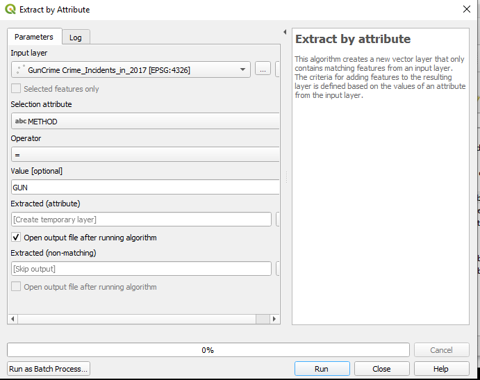
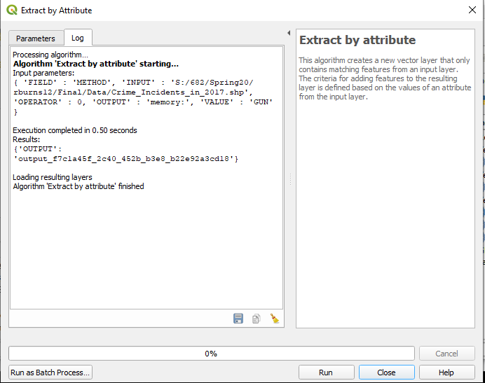

# GEOG682 Final Project
## Washington, DC Gun Crime Analysis Mapping
Rob Burns

4/28/2020


## Introduction

This is my final project for GEOG682 "Open Source Intelligence", a class that is part of the University of Maryland's Geospatial 
Intelligence Masters Program. For this project I will be analyzing gun crime data made publicly available by the city of Washington, DC 
to determine which areas of the city are most heavily effected by gun crime. Specifically I will be looking at which wards within the 
city have the highest rates of gun incidents per 10,000 ward residents. "Gun incidents" here is a multi-part phenomenon, as I will be 
looking separately at 2 different types of gun incidents: gun crimes and gun shots, both reported by the Washington DC, Metropolitan 
Police Department (MPD). Gun crimes are reported by the DC MPD using Analytical Services Application (ASAP) and gun shots are detected 
using Shot Spotter, a sensor network operated throughout DC by MPD. First I will perform my analysis manually using QGIS 3.4.9 and the 
tools and features it provides. This manual analysis within QGIS will determine the rates of gun crime and gun shots within each of DC's 
wards and will be used to produce maps that graphically depict my results. Then I will also attempt to automate this process using the 
QGIS Python Console and PYQGIS scripting. Python scripting will allow for automating the process of importing and performing spatial 
analysis on my input layers and will in the end show us the desired result of the rate of gun incidents in each ward, though this PyQGIS 
automation will not be used to synthesize these results into a map. All of this analysis will be evaluated with the goal of determining 
potential locations for expanding the DC MPD's Shot Spotter network, looking for new locations that would provide the most benefit for 
new Shot Spotter sensor placement. 

## Analysis

 This analysis made use of 3 datasets made available by the Washington, DC Office of the Chief Technology Officer as shapefiles on 
 the "Open Data DC" website (https://opendata.dc.gov/):

 1) "Shot Spotter Gun Shots": A point layer showing the locations of gun shots in DC detected by Shot Spotter.
 2) "Ward from 2012": A polygon layer representing the boundaries of DC's 2012 election wards.
 3) "Crime Incidents in 2017": A point layer representing the locations and attributes of crime incidents reported in
 ASAP in 2017.
      
The first map provides an analysis of the number of gun crimes committed per 10,000 people in 2017 for each DC ward. This map was 
created manually within QGIS. First, I filtered out only the gun crimes from the "Crime_Incidents_in_2017" layer, within the Query 
Builder setting the field "METHOD" as equal to the value "GUN". This gave us a point layer of only the gun crime incidents in 2017 which 
I named "Gun_Crime_Incidents_2017". Next I used the "Count Points In Polygon" vector analysis tool to count the number of gun crime 
incident points in each ward polygon, counting the number of points from "Gun_Crime_Incidents_2017" within the different polygons from 
the "Ward_From_2012" layer. The output of this was a new layer named "Count" which contained a field called "GUN_CRIME_INCIDENTS" which 
gave the number of points within each ward poygon. Then, using the "Field Calculator" tool within the Processing Toolbox I ran an 
expression on the "Count" layer dividing the number of gun crime incidents by the 2010 population of each ward divided by 10,000 
("GUN_CRIME_INCIDENTS /  ( POP_2010 / 10000)"). The result was a new attribute field called "GUN_CRIME_PER_10000". Using 
the "Symbology" tab I categorized each of the ward polygons into a separate color based on the "WARD" field to differentiate the wards 
from each other. I labeled each ward with the numeric value of the "GUN_CRIME_PER_10000" field to show the number of gun crimes per 
10,000 residents of each ward. Finally, I used the Print Layout window to add in all of the necessary map components. The resulting map 
is pictured below.


The second map is an analysis of the number of shots detected by Shot Spotter per 10,000 people in 2017 for each ward, also done
manually in QGIS. No filtering was required for this layer since it already only displayed the relevant points captured by Shot 
Spotter. I started this processing by using the "Count Points In Polygon" function, using "Shot_Spotter_Gun_Shots" as the point layer 
and "Ward_From_2012" as the polygon layer. The output was a new layer called "Shot Count" containing a field called "SHOT_SPOTS" which 
gave the number of gun shots detected in each ward. Next I used the "Field Calculator" tool on the "Shot Count" layer to determine the 
number of shots detected per 10,000 people in each ward. Within the "Field Calculator" I ran an expression to divide the number of shots 
detected in each ward by the 2010 population in each ward divided by 10,000 ("SHOT_SPOTS /  ( POP_2010 / 10000)"). The output was a new
attribute field called "SHOTS_SPOT_PER_10000". Using the “Symbology” tab I categorized each of the ward polygons into a separate color 
based on the "WARD" field to show which ward was which. I labeled each ward with the value of the "SHOTS_SPOT_PER_10000" field to give 
the number of shots detected per 10,000 people in each ward. As with the previous map I used the Print Layout window to add in all of 
the necessary map components in order to fully complete the map. The resulting map is pictured below.


 
 ## Automation
 
 In addition to the analysis done manually within QGIS to build the maps displaying the number of gun incidents per 10,000 residents in 
 each ward, I created an automated process using pyQGIS within the QGIS Python Console that would automatically perform all of the 
 functions that I had earlier done manually. This would allow the process to be streamlined by future analysts. Because slightly 
 different steps were necessary for each of the two analyses, the automation for both were slightly different.
 
Prior to performing any analysis I had to read in the three shapefiles that formed the base of my analysis. In each case I set the 
directory path for each shapefile and then read the shapefile in using the "addVectorLayer" command. The code that I used to read in the 
2012 DC ward shapefile is included below as an example of the process.

```python
Districtpath = "S:/682/Spring20/rburns12/Final/Data/Ward_from_2012.shp"
DCdistricts = iface.addVectorLayer(Districtpath, "DCdistricts", "ogr")
```

Once all of the shapefiles were read in, I could begin my analysis of the spatial data. The first section of the automation was the gun 
crime data. In order to perform my automation, I reverse engineered the necessary code by looking at the settings and values that were 
used when I ran the relevant function manually in QGIS. In each case the code that was used by the function was output by the "Log" tab 
of the function's window. I copied the output code and applied those values to the appropriate pyQGIS function in the Python Console. 

As an example of this process, I will use the first function applied to the gun crime data. For this analysis we wanted to look only at 
gun crimes, so we would filter out all others using the "Extract by Attribute" function. Within this function we wanted to only look at 
points in which the field "METHOD" had the attribute value "GUN". An example of the manual process will be shown below, with only 
difference from the original process being that the "Output" field is left blank and will only appear as "memory" for this example.






The above screenshots show the values input for the manual function, as well as the output log code. For the automation I simply used 
the given log code values with the "qgis:extractbyattribute" command in the Python Console as shown below. As mentioned, the only difference is that in this real code snippet the "OUTPUT" field has an actual file path while in the earlier example there was none.

```python
processing.run("qgis:extractbyattribute",{ 'FIELD' : 'METHOD', 'INPUT' : 
'S:/682/Spring20/rburns12/Final/Data/Crime_Incidents_in_2017.shp', 'OPERATOR' : 0, 'OUTPUT' : 
'S:/682/Spring20/rburns12/Final/Data/Gun_Crimes_2017.shp', 'VALUE' : 'GUN' })
```

From there, using a similar "code reverse engineering method" I used the "Count Points in Polygon" function to count all of the gun 
crime points in each ward polygon. Then using the "Advanced Python Field Calculator" I calculated the number of gun crimes in each ward 
by dividing the number of gun crimes by the population of each ward divided by 10,000. The rest of the code is shown below.

```python
processing.run("qgis:countpointsinpolygon",{ 'CLASSFIELD' : None, 'FIELD' : 'GUNINCIDENTS', 'OUTPUT' : 
'S:/682/Spring20/rburns12/Final/Data/Gun_Crimes_2017_per_Ward.shp', 'POINTS' : 
'S:/682/Spring20/rburns12/Final/Data/Gun_Crimes_2017.shp', 'POLYGONS' : 'S:/682/Spring20/rburns12/Final/Data/Ward_from_2012.shp', 
'WEIGHT' : None })
Path1= "S:/682/Spring20/rburns12/Final/Data/Gun_Crimes_2017_Per_Ward.shp"
GunCrimePerWard = iface.addVectorLayer(Path1, "GunCrimePerWard", "ogr")
processing.run("qgis:advancedpythonfieldcalculator",{ 'FIELD_LENGTH' : 10, 'FIELD_NAME' : 'GunCrimePer10K', 'FIELD_PRECISION' : 3, 
'FIELD_TYPE' : 0, 'FORMULA' : 'value = <GUNINCIDEN> /(<POP_2010>/10000)', 'GLOBAL' : '', 'INPUT' : 
'S:/682/Spring20/rburns12/Final/Data/Gun_Crimes_2017_Per_Ward.shp', 'OUTPUT' : 
'S:/682/Spring20/rburns12/Final/Data/Gun_Crimes_Per_10k.shp' })
GunGrimePer10K = iface.addVectorLayer('S:/682/Spring20/rburns12/Final/Data/Gun_Crimes_Per_10k.shp', "GunCrimePer10K", "ogr")
```

The method for calculating the number of gun shots per 10,000 was much the same, minus the filter step. ***[I realized too late that I 
didn't filter for only the gun shots detected in 2017, that was my bad. By the time I caught it on May 11 I felt it was too late for me 
to realistically be able to alter my code without jeopardizing the project as a whole to filter for only gun shots in 2017. I apologize 
and I understand that you will need to count off. However I think this may actually benefit my analysis, which I discuss in the "Limitations" section.]*** I counted the number of gun shots in each polygon using the "Count Points in 
Polygon" function and then used the "Advanced Python Field Calculator" to calculate the number of gun shots divided by ward population 
divided by 10,000.

After each section of automation I showed my results by printing the resulting calculation of incidents per 10,000 per ward. The code I 
used to print the number of gun shots per 10,000 ward residents is as follows.

```python
print("Shots detected by ShotSpotter per 10,000 Residents in each DC Ward in 2017")
lyr = iface.activeLayer()
features = lyr.getFeatures()
for ft in features:print(ft["Ward"],ft["ShotsPer10"])
```


## Results

After my analysis of the gun crime and gun shot location data for Washington, DC I was able to find multiple wards that would be well 
served by an expansion of the Shot Spotter network. More specifically, I believe that I was able to determine two primary candidates 
(Ward 2 and Ward 3) and one secondary candidate (Ward 8), grouped into categories based on the benefit that would be provided by 
additional Shot Spotter coverage. 

I recommend that Ward 2 and Ward 3 be given main priority for Shot Spotter covereage due to the current almost total lack of coverage 
within both wards. Both wards are admittedly relatively safe according to the data, but this apparent safety can also cause a false 
sense of security relative to real gun crime. A tendency that I found when examining the data was that most wards had a higher number of 
gun shots then gun crimes. This makes sense to me intuitively in the following sense: Gun crimes only represent individuals who were 
actually CAUGHT, whereas gun shots represent more the actual level of gun activity in a ward. As a result, you would expect that 
documented gun crimes would be proportional to, but lower than, detected gun shots. This seems to be the result across Washington with 
two exceptions: Ward 2 and Ward 3. In both of these wards the data reflected the opposite: gun shots detected were equal to gun crimes 
in Ward 2 (7 in both) and Ward 3 actually had NO gun shots detected compared to three gun crime incidents. Taking the trend we mentioned 
earlier into account, of gun shots outnumbering gun crimes, I believe that this reflects not an actual lack of gun shots but simply a 
lack of detection. There are shots happening that are not being detected, or at least reason to believe so. Indeed, when examining the 
raw data of gun shot locations from the "Shot_Spotter_Gun_Shots" in QGIS, it appears that gun shots simply stop at the borders of Wards 
2 and 3 despite major clusters on the other side. I believe that Ward 2 and 3 of DC are not getting the level of Shot Spotter coverage 
they deserve, especially considering the presence of residential neighborhoods in Ward 3 and US government property in Ward 2. 

A secondary recommendation is additional Shot Spotter coverage in Ward 8. Ward 8 already has the highest number of recorded gunshots and 
has plenty of shot detections, but the raw data from the Shot Spotter shapefile shows a large chunk of the ward nearer the Potomac River 
with no gun shots detected. Given the sheer amount of shots detected in the rest of the ward it would benefit the city to extend 
coverage within the ward to ensure no gaps in coverage for an already critical ward.


## Limitations

There were three limitations of this analysis. Two of which I believe were true limitations reflecting the data available, one of which 
was an error of analysis that despite being a "mistake" may have strengthened my case in my recommendations. I will discuss the latter 
first in this section.

When analyzing the Shot Spotter data, I did not filter out the data for 2017 and instead considered all shots in the data set from 2014-
2019. At first this seems to be a limitation since comparing shot detections for a five year span to gun crimes for only the year of 
2017 could skew the data. But I think that the results we got only strengthen my recommendations. Ward 2 had seven gun crimes in just 
2017 versus seven shots detected in all five years between 2014 and 2019. And Ward 3 had NO gun shots detected in all five years despite 
having three gun crimes. Taken with the earlier trend of most wards having more gun shots detected then crimes reported, this 
discrepency only underscores to me that the lower number reported for the five year period versus the single year most likely reflects a 
lack of coverage within the area rather then an actual lack of gun shot activity.

The two other limitations represent the basic difficulty of gathering data. The first is the simple fact that sparked this entire 
project: that data is only available when it is first collected. Thus all of our data is constrained by the possiblilty that their exist 
other incidents that were missed that could skew our data. That is a very real possibility, though hopefully our efforts in this project 
will rectify that. The other limitation is the limitation of the sensors themselves. The Shot Spotter system is constrained by the 
technical limitations of the sensors and there is always the possibility that the acoustice properties of DC's urban environment could 
interfere with its functionality, as well as the system having a documented history of false positives with sounds such as fireworks. 
There have been attempts to rectify this, but the possibility for mistaken readings remains. (Petho et al, Washington Post, "ShotSpotter 
detection system documents 39,000 shooting incidents in the District") Still, I believe that the sheer amount of data available here 
overwhelms the limitations and that this analysis provides an effective method of finding suitable expansion sites for Shot Spotter 
sensors.
